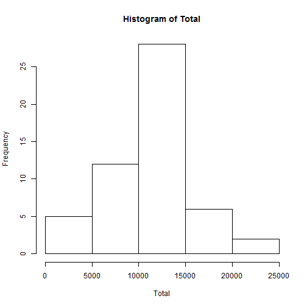
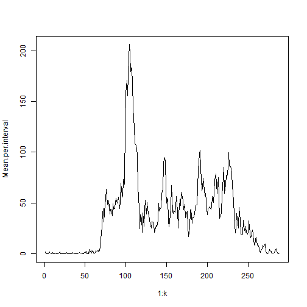
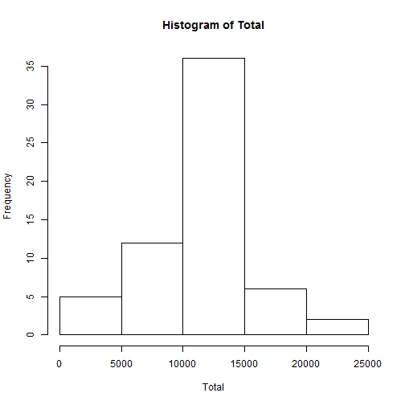
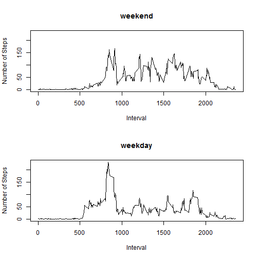

Assignment 1 in Reproducible Research Coursera Course
========================================================

Loading and preprocessing the data
------------------------

Show any code that is needed to

### 1. Load the data (i.e. read.csv())

Also doing some basic checking:


```r
setwd("C:/PB User Files/R Projects/Coursera/Reproducible Research")
df  <- read.csv("activity.csv")
dim(df)
```

```
## [1] 17568     3
```

```r
df[1:10,]
```

```
##    steps       date interval
## 1     NA 2012-10-01        0
## 2     NA 2012-10-01        5
## 3     NA 2012-10-01       10
## 4     NA 2012-10-01       15
## 5     NA 2012-10-01       20
## 6     NA 2012-10-01       25
## 7     NA 2012-10-01       30
## 8     NA 2012-10-01       35
## 9     NA 2012-10-01       40
## 10    NA 2012-10-01       45
```

### 2. Process/transform the data (if necessary) into a format suitable for your analysis

Removing NA's just in case


```r
Count.NA <- function(x) sum(is.na(x))
apply(df,2,Count.NA)
```

```
##    steps     date interval 
##     2304        0        0
```

```r
df.No.NA <- df[!is.na(df[,"steps"]),]
```

What is the mean total number of steps taken per day?
------------------------

For this part of the assignment, you can ignore the missing values in the dataset.

### 1. Make a histogram of the total number of steps taken each day


```r
attach(df.No.NA)
Total  <- tapply(steps,date,FUN=sum)
hist(Total)
```

 

```r
Total <- Total[!(is.na(Total))]
```

### 2. Calculate and report the mean and median total number of steps taken per day

The total number of steps taken per day has the mean of 10766 and the median 10765. **[This uses in-line R code]**

**And here it is again, if you want to see the code:**

The total number of steps taken per day has the mean of 

```r
as.integer(mean(Total))
```

```
## [1] 10766
```
and the median 


```r
median(Total)
```

```
## [1] 10765
```


What is the average daily activity pattern?
------------------------

### 1. Make a time series plot (i.e. type = "l") of the 5-minute interval (x-axis) and the average number of steps taken, averaged across all days (y-axis)


```r
Mean.per.interval  <- tapply(steps,interval,FUN=mean)
# names(Mean.per.interval)
k <- length(Mean.per.interval)
plot(1:k,Mean.per.interval,type="l")
```

 

```r
detach("df.No.NA")
```

### 2. Which 5-minute interval, on average across all the days in the dataset, contains the maximum number of steps?


```r
which(Mean.per.interval==max(Mean.per.interval))
```

```
## 835 
## 104
```
Note: the first number above is the time (hours/minutes) and the second is the consecutive interval number

Imputing missing values
------------------------

Note that there are a number of days/intervals where there are missing values (coded as NA). The presence of missing days may introduce bias into some calculations or summaries of the data.

### 1. Calculate and report the total number of missing values in the dataset (i.e. the total number of rows with NAs)


```r
Count.NA <- function(x) sum(is.na(x))
apply(df,2,Count.NA)
```

```
##    steps     date interval 
##     2304        0        0
```

Note: No NA's for date and interval, only for steps

### 2. Devise a strategy for filling in all of the missing values in the dataset. The strategy does not need to be sophisticated. For example, you could use the mean/median for that day, or the mean for that 5-minute interval, etc.

**The strategy should depend on the nature of missing values. So, need to learn the position of NA's, and the associated values for "steps"**

Are all time intervals included in data on all days (possibly with NA's)?

```r
attach(df)
all(table(date, interval)==1)
```

```
## [1] TRUE
```
How many days?

```r
AllDates <- unique(date)
No.of.Days <- length(AllDates)
No.of.Days
```

```
## [1] 61
```

How many Intervals?

```r
AllIntervals <- unique(interval)
No.of.Intervals <- length(AllIntervals)
No.of.Intervals
```

```
## [1] 288
```

Checking:

```r
No.of.Days*No.of.Intervals 
```

```
## [1] 17568
```

```r
dim(df)
```

```
## [1] 17568     3
```

Calculating numbers of NA's for various days and intervals


```r
p=16
k.v=c(rep(p,3),61-p*3)

Step.mat <- matrix(steps,No.of.Intervals,No.of.Days)
apply(Step.mat,2,Count.NA)
```

```
##  [1] 288   0   0   0   0   0   0 288   0   0   0   0   0   0   0   0   0
## [18]   0   0   0   0   0   0   0   0   0   0   0   0   0   0 288   0   0
## [35] 288   0   0   0   0 288 288   0   0   0 288   0   0   0   0   0   0
## [52]   0   0   0   0   0   0   0   0   0 288
```

```r
apply(Step.mat,1,Count.NA)
```

```
##   [1] 8 8 8 8 8 8 8 8 8 8 8 8 8 8 8 8 8 8 8 8 8 8 8 8 8 8 8 8 8 8 8 8 8 8 8
##  [36] 8 8 8 8 8 8 8 8 8 8 8 8 8 8 8 8 8 8 8 8 8 8 8 8 8 8 8 8 8 8 8 8 8 8 8
##  [71] 8 8 8 8 8 8 8 8 8 8 8 8 8 8 8 8 8 8 8 8 8 8 8 8 8 8 8 8 8 8 8 8 8 8 8
## [106] 8 8 8 8 8 8 8 8 8 8 8 8 8 8 8 8 8 8 8 8 8 8 8 8 8 8 8 8 8 8 8 8 8 8 8
## [141] 8 8 8 8 8 8 8 8 8 8 8 8 8 8 8 8 8 8 8 8 8 8 8 8 8 8 8 8 8 8 8 8 8 8 8
## [176] 8 8 8 8 8 8 8 8 8 8 8 8 8 8 8 8 8 8 8 8 8 8 8 8 8 8 8 8 8 8 8 8 8 8 8
## [211] 8 8 8 8 8 8 8 8 8 8 8 8 8 8 8 8 8 8 8 8 8 8 8 8 8 8 8 8 8 8 8 8 8 8 8
## [246] 8 8 8 8 8 8 8 8 8 8 8 8 8 8 8 8 8 8 8 8 8 8 8 8 8 8 8 8 8 8 8 8 8 8 8
## [281] 8 8 8 8 8 8 8 8
```

```r
detach("df")
```

conclusion: On some days, all "steps" values are NA's, and on the remaining days, there are no NA's.

### 3. Create a new dataset that is equal to the original dataset but with the missing data filled in.

Note: The best approach would be not to do any imputation and simply remove those days with missing data. However, for the sake of doing "imputation," I'm going to use the average day profile shown earlier in the time series plot.


```r
df.imputed <- df

df.imputed$steps[is.na(df.imputed$steps)] <- Mean.per.interval # this works only
      # because NA's are in separate days and all intervals are nicely ordered
```

### 4. Make a histogram of the total number of steps taken each day and Calculate and report the mean and median total number of steps taken per day. Do these values differ from the estimates from the first part of the assignment? What is the impact of imputing missing data on the estimates of the total daily number of steps?


```r
attach(df.imputed)
Total  <- tapply(steps,date,FUN=sum)
hist(Total)
```

 

Note: Since we added 8 days with average profile, this added 8 values of "total number of steps per day." The bars in the histogram are the same, except for the middle bar that no includes those 8 values. This is one reason why this imputation was really a bad idea. 

The total number of steps taken per day has the mean of 10766 and the median 10766

Note: Clearly the average should not change (and it didn't), but the median did change (only slightly).

Are there differences in activity patterns between weekdays and weekends?
------------------------

For this part the weekdays() function may be of some help here. Use the dataset with the filled-in missing values for this part.

**Note: Using imputed data for this part is really a bad idea, because the imputed days will now look the same, no matter if these are weekdays or weekend. Nevertheless, I will just follow the instructions.** 

### 1. Create a new factor variable in the dataset with two levels - "weekday" and "weekend" indicating whether a given date is a weekday or weekend day.


```r
Days <- weekdays(as.Date(date))
Days.short <- substr(Days,1,2)
weekend <- rep("weekday",length(Days.short))
weekend[((Days.short=="Sa")|(Days.short=="Su"))] <- "weekend"
weekend <- as.factor(weekend)
levels(weekend)
```

```
## [1] "weekday" "weekend"
```

##### 2. Make a panel plot containing a time series plot (i.e. type = "l") of the 5-minute interval (x-axis) and the average number of steps taken, averaged across all weekday days or weekend days (y-axis).


```r
Mean.per.interval  <- tapply(steps,list(weekend,interval),FUN=mean)
k <- length(Mean.per.interval)
Range.Y <- range(Mean.per.interval)
par(mfrow=c(2,1))
for (i in 2:1){
   plot(AllIntervals,Mean.per.interval[i,],type="l",ylab="Number of Steps",
        xlab="Interval",main=levels(weekend)[i],ylim=Range.Y)
}
```

 

```r
detach("df.imputed")
```

The patterns for the weekday and weekend averages are somewhat different.

